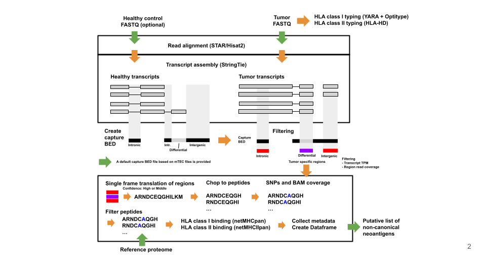




# A non-canonical neoantigen prediction pipeline


Pipeline takes RNA-seq FASTQ files from Tumor and and optionally RNA-seq from healthy tissue to predict neoantigens.


The pipeline uses the following tools:


* YARA v. 1.0.2
* OptiType
* HLA-HD
* Samtools v. 1.12
* Bedtools v. 2.26.0
* HISAT2 v. 2.1.0
* StringTie v. 2.1.4
* Seqkit v. 2.0.0
* GFFread v. 0.12.3
* jvarkit (sortsamrefname.jar (v. d29b24f2b), biostar154220.jar (v. d29b24f2b), sam4weblogo.jar (v. 1ca216453)) (Lindenbaum 2015)
* netMHCpan v. 4.0
* netMHCIIpan


In brief, NovumRNA takes single- or paired-end tumor RNA-seq FASTQ files as input. The pipeline also allows to re-run with intermediate files generated in a previous run. Reads are aligned to the reference genome with STAR (Dobin et al. 2013), or HISAT2 (Kim et al. 2019) to perform reference-guided transcript assembly using StringTie (Pertea et al. 2015). Tumor-specific and differentially expressed transcript fragments are identified by filtering against an internal normal control filtering database in the form of a capture BED file (see 2.2). Users can provide their own samples to extend the capture BED file. Transcript fragments need to fulfill expression and coverage criteria to be further considered, which can be defined by the user in the novumRNA.config file. Surviving transcript fragments are then translated and chopped into peptides of a specified length. Peptides are then filtered against the reference proteome. In parallel, the patient-specific human leukocyte antigen (HLA) class I and class II type is identified using OptiType (Szolek et al. 2014) and HLA-HD (Kawaguchi et al. 2017). Finally, tumor-specific peptides are tested for their binding affinity towards the patient’s HLA class I and class II molecules using netMHCpan-4.1 (Reynisson et al. 2020) and netMHCIIpan (Karosiene et al. 2013), to prioritize putative ncnas with higher likelihood of being presented to T cells. By providing additional annotation files, identified ncnas can be further categorized; NovumRNA by default provides a file to identify ncnas derived from ERVs.





## Hardware recommendations


NovumRNA is designed to run on high memory multi-core servers (recommended > 16 cores, min. 64GB RAM, > 5 TB of free disk space). For analysis of larger cohorts we strongly recommend running NovumRNA on a HPC cluster with multiple compute nodes that meet these specifications. However, by tuning the memory and CPU parameters in ```novumRNA.config``` it should also be possible to run NovumRNA on systems with lower CPU and memory resources.


## 1. Installation


### 1.1 Nextflow


The command below may be used to install Nextflow. Please see also the installation instructions at:
<https://www.nextflow.io/index.html#GetStarted>


```
curl -s https://get.nextflow.io | bash


```


### 1.2 Analysis tools and software packages


The pipeline will install almost all required tools via Singularity images or conda environments. If preferred one can also use local installations of all tools (not recommended, please see `Manual installation` at the end of this document)


The software that needs to be present on the system is **Java** (minimum version 8), **Nextflow** (see above), **Singularity**, **Conda** (optional).


**Optional but recommended:**
Due to license restrictions you may also need to download and install **HLA-HD** by your own, and set the installation path in ```conf/params.config```. _If HLA-HD is not available Class II neoepitopes will NOT be predicted_


### 1.2 References


The pipeline requires different reference files, indexes and databases:


please see ```conf/resources.config```


For each NovumRNA version we prepared a bundle with all needed references, indexes and databases which can be obtained from:


`https://apps-01.i-med.ac.at/resources/nextneopi/`


the bundle is named to match the release version `NovumRNA_<version>_resources.tar.gz`


e.g.:


<https://apps-01.i-med.ac.at/resources/nextneopi/novumRNA_1.0_resources.tar.gz>
download and extract the contents of the archive into the directory you specified for ```resourcesBaseDir``` in the ```conf/params.config``` file.


The structure should look as shown blow:


```
├── {resourcesBaseDir}
    ├── databases
    ├── ExomeCaptureKits
    └── references
```


**Notes**


1. You may also provide your own versions of these files. To do so, please change the ```conf/resources.config``` accordingly.


Refs:


* <https://gatk.broadinstitute.org/hc/en-us/articles/360036212652-Resource-Bundle>
* <https://console.cloud.google.com/storage/browser/genomics-public-data/resources/broad/hg38/v0/>
* <ftp://gsapubftp-anonymous@ftp.broadinstitute.org/bundle/>
* <https://gdc.cancer.gov/about-data/gdc-data-processing/gdc-reference-files>
* <https://www.gencodegenes.org/human/>


## 2. Usage


NovumRNA is implemented in ```nextflow``` ```dsl2``` and consists of three main scripts:
- ```ncna_main.nf``` Contains the workflows
- ```modules.nf``` Processes included in the workflows are defined here. Processes are wrapped either around third party tools, custom python scripts or bash commands. All custom python scripts are stored in the ```bin``` folder.
- ```nextflow_ncna.config``` Contains all parameters needed to run the ```ncna_main.nf```


```ncna_main.nf``` contains two workflows:
```analysis```: Prediction of cancer specific non canonical neoantigens
```analysis_star```: Prediction using STAR as aligner
````analysis_star_riboseq```: Prediction with ribo-seq data
```analysis_short```: Run with intermediate files from previous run
```capture_bed```: Creation of reference database used in the analysis workflow to filter for cancer specificity
```capture_bed_gtf```: Reference database built from GTF files.


Which workflow will be executed can be specified via ```-entry workflow``` on the command line.


Before running the pipeline, the config files in the ```conf/``` directory may need to be edited. In the
```params.config``` parameters default settings are defined. The ```process.config```
is a template for the configuration of the single processes, you may check
the number of CPUs assigned for each process and adjust according to your systems capabilities.


Most pipeline parameters can be edited in the ```params.config``` file or changed on run time with command line options by using ```--NameOfTheParameter``` given in the ```params.config```.
References, databases should be edited in the ```resources.config``` file.


To perform the classic analysis of tumor RNA-seq data, use the following command:


```
nextflow run ncna_15.nf -w /home/ausserh/myScratch/work/ -profile icbi -c nextflow_ncna_15.config -entry analysis
```
**Profiles:** conda or singularity


We highly recommend using either the ```singularity``` or ```conda``` profile. You can specify one of the two profiles using the option ```-profile singularity``` or ```-profile conda```. This way you do not have to care about installing all the required software including all
its dependencies.


**Profiles:** cluster


We strongly recommend to run the pipeline on a HPC cluster. You can enable runs in cluster mode by using a profile named e.g. **cluster** and the option ```-profile singularity,cluster``` or ```-profile conda,cluster```


For an example SGE cluster profile, please see ```profiles``` in ```conf/profiles.config```. You may uncomment and adjust the cluster profile to your scheduling system.


**Sequencing data input:**


Besides raw reads in **FASTQ** fromated files, input data may also be provided in **BAM** format.


**Mandatory arguments:**


```-config``` NovumRNA config file, e.g. `-config conf/params.config`


```--accept_license``` accept the license terms


```--batchFile```


Make sure that your batchFile CSV includes the column names as shown in the examples below as header line. See also `example_batchFile_FASTQ.csv` or `example_batchFile_BAM.csv`


**FASTQ raw reads**


*CSV-file with Tumor RNAseq reads


 | sampleName | reads1 | reads2 |
 | ---------- |------- | ------ |
 | sample1 | reads_s1_1.fastq.gz | reads_s1_2.fastq.gz |
 | sample2 | reads_s2_1.fastq.gz | reads_s2_2.fastq.gz |


* CSV fields of the `batchFile`
* reads1: forward reads (can be FASTQ or gzipped FASTQ)
* reads2: reverse reads (if paired end sequencing was used, empty for single end)


**BAM files**


**Note:** NovumRNA can be rerun using intermediate files from a previous run. Alignment and transcript assembly are the computationally most demanding steps, but also the most standardized ones. When simply changing some downstream cut-offs, run time decreases heavily if restarted after these steps.


*CSV-file with Tumor RNAseq data from a previous run:


 | sampleName | GTF | BAM | BAI | HLA |
 | ---------- |-----| ---------- | ------- | --- |
 | sample1 | sample1.bam | sample1.bam.bai | sample1_stringtie.gtf  | sample1_hla.tsv
 | sample2 | sample2.bam | sample2.bam.bai | sample2_stringtie.gtf | sample2_hla.tsv


**Notes**


* Please make sure your **```/tmp``` (or the directory set as ```$TMPDIR```) has a lot of free space (> 50GB, depending on input data size)**. You may change the tmp dir used by nextNEOpi by setting the parameter ```tmpDir``` in ```params.config``` or on the command line ```--tmpDir``` to a directory of your choice.


**Example run command with batchfile:**


```
nextflow run nextNEOpi.nf \
    --batchFile batchfile.csv \
    -config conf/params.config \
    --outputDir /data/results/nextNEOpi/myResults \
    --tmpDir /my/huge/tmpDir \
    -profile singularity,cluster \
    -resume
```


**Optional argument:**


```--TCR``` Run mixcr for TCR prediction Default: true


**Further options:** There are many more options that can be set in the params.conf file or specified on the commandline (see ```    conf/params.config```)


## 3. Output


The Pipeline stores its ouput in the following structure:


```
RESULTS
├── analyses
│   ├── Subject_01
│   │   ├── 01_preprocessing
│   │   ├── 02_alignments
│   │   ├── 03_baserecalibration
│   │   ├── 03_realignment
│   │   ├── 04_expression
│   │   ├── 04_variations
│   │   ├── 05_vep
│   │   ├── 06_proteinseq
│   │   ├── 07_MutationalBurden
│   │   ├── 08_CNVs
│   │   ├── 09_CCF
│   │   ├── 10_HLA_typing
│   │   ├── 11_Fusions
│   │   ├── 12_pVACseq
│   │   ├── 13_mixMHC2pred
│   │   ├── 14_CSiN
│   │   ├── 14_IGS
│   │   ├── 15_BCR_TCR
│   │   └── QC
│   ├── Subject_02
│   │   ├── [...]
│   ├── [...]
│   │   ├── [...]
│   ├── Subject_n
│   │   ├── [...]
├── Documentation
├── neoantigens
│   ├── Subject_ID
│   │   ├── Class_I
│   │   ├── Class_II
│   │   └── Final_HLAcalls
│   ├── Subject_02
│   │   ├── [...]
│   ├── [...]
│   │   ├── [...]
│   ├── Subject_n
│   │   ├── [...]
├── pipeline_info
│   └── icbi
└── supplemental
    ├── 00_prepare_Intervals
    └── 01_prepare_CNVkit
```